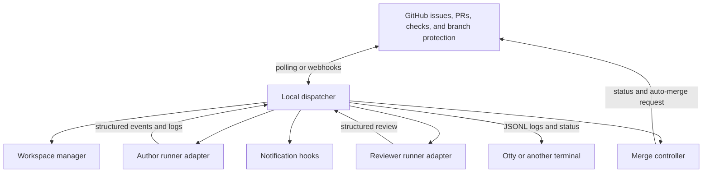
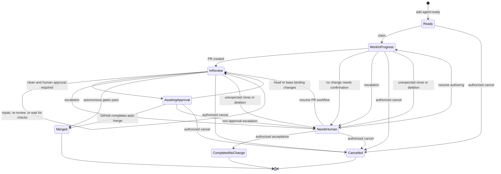

# Eupho

**Status:** Revised draft
**Version:** 0.2
**Last updated:** 2026-08-12

> **Suggested review path:** Read Sections 1–6 for intent, Section 9 for lifecycle behavior, Section 20 for the version 0.1 acceptance boundary, and Section 22 for the decisions resolved during review.

Sections 7–20 and 22 are normative. Sections 1–6 are explanatory, Section 21 is rollout guidance, and Sections 23–24 are roadmap and reference material. If wording conflicts, the normative architecture, lifecycle, security, interface, profile, acceptance, and resolved-decision requirements take precedence.

## 1. Summary

This document specifies a local-first orchestration system that turns eligible GitHub issues into isolated agent implementation runs, pull requests, cross-agent code reviews, repair cycles, and policy-gated merges.

GitHub is the durable control plane. Issues, labels, pull requests, review comments, Check Runs, required checks, and branch protection represent externally visible workflow state. Claude Code, Codex, OpenCode, or future coding agents are replaceable runners. Otty is an optional viewport for observing and intervening in runs; the workflow must continue to function without Otty.

The target low-risk happy path is:

```text
GitHub issue marked ready
        -> dispatcher claims issue
        -> isolated workspace and branch created
        -> author agent implements and tests
        -> pull request opened
        -> independent reviewer agent reviews
        -> author agent repairs merge-blocking findings
        -> required checks pass
        -> GitHub auto-merge completes the pull request
```

Automation pauses and requests human attention only when policy, ambiguity, permissions, repeated failure, or an unsafe action prevents deterministic progress.

Version 0.1 defaults to the `human-final-approval` profile, but it also ships one explicitly configured, narrow autonomous class—such as documentation-only work—so the no-intervention happy path is exercised before release. Autonomous classes must use unattended execution and are opt-in per repository.

## 2. Problem

Coding agents can edit repositories and run commands, but a reliable software-delivery workflow also requires:

- durable state that survives terminal and process restarts;
- exclusive task claiming and bounded concurrency;
- isolated workspaces for simultaneous tasks;
- consistent author, reviewer, and repair loops;
- enforceable merge gates outside an agent prompt;
- observable logs and artifacts;
- explicit human escalation and resume behavior;
- support for multiple agent products without coupling the workflow to one CLI.

A shell loop can demonstrate the happy path, but it does not by itself provide recovery, idempotency, safe concurrency, review lifecycle management, or a trustworthy merge boundary.

## 3. Goals

The system must:

1. Discover GitHub issues explicitly marked as ready for automation.
2. Claim each issue once and process multiple issues up to a configured concurrency limit.
3. Create one isolated workspace and branch per run: a linked worktree for attended execution or a disposable clone for unattended execution.
4. Run an author agent through a product-specific adapter.
5. Validate the resulting changes before publishing them.
6. Create or update a pull request linked to the issue.
7. Run an independent review, preferably with a different model or agent product.
8. Iterate between review and repair until the change is accepted or a limit is reached.
9. Rely on GitHub branch protection and required checks as the final merge authority.
10. Notify a human with a concise reason and recovery action when automation pauses.
11. Recover safely after dispatcher, terminal, agent, or machine restarts.
12. Expose each run in a terminal-friendly form suitable for Otty without requiring Otty.

## 4. Non-goals

Version 0.1 will not:

- decide product priorities or autonomously create its own backlog;
- bypass GitHub branch protection, required reviews, or required checks;
- give an agent authority to change post-claim workflow state directly; authorized maintainers still control intake, resume, approval, and cancellation;
- support arbitrary multi-repository changes in one run;
- provide a general-purpose agent graph or distributed workflow engine;
- implement its own process sandbox; unattended execution requires a configured OS, container, or VM sandbox that satisfies Section 14;
- automatically resolve product, legal, security, or architectural decisions;
- replace GitHub as the human collaboration and audit interface;
- require a graphical agent IDE or terminal-specific integration;
- support GitHub merge queues; version 0.1 requires strict up-to-date branch protection and uses ordinary auto-merge.

## 5. Design principles

### 5.1 GitHub is the durable control plane

Workflow state visible to users lives in GitHub. A fresh dispatcher must be able to reconstruct every active run from GitHub plus the repository and the durable administrator state root, which contains local policy, metadata-signing keys, revision high-water marks, control and cost ledgers, and workspace markers. That state root is small but security-critical and must be backed up.

### 5.2 Agents are replaceable workers

An agent receives a bounded task, operates in an isolated workspace, and returns structured results. The dispatcher owns claiming, state transitions, publishing, retries, escalation, and merge eligibility.

### 5.3 Branch protection is the merge authority

No prompt, model verdict, or local flag can override protected-branch rules. The dispatcher may enable GitHub auto-merge; it must not force-push or use an administrative bypass to merge.

### 5.4 Every operation is resumable and idempotent

Replaying a lifecycle step must either produce the same result or detect the existing result. A restart must not create duplicate branches, pull requests, reviews, or comments.

### 5.5 Human attention is an explicit state

When automation cannot continue safely, it records `needs-human` with a reason code, supporting evidence, the last successful step, and the exact action needed to resume. Expected branch-protection approval is modeled separately as `awaiting_approval`, a non-error waiting phase that preserves a successful review gate.

### 5.6 Issue and repository content is untrusted input

Issue bodies, comments, source files, test output, and reviewer text may contain prompt injection or malicious instructions. They are task data, not system policy.

## 6. User experience

### 6.1 Normal flow

1. A maintainer adds `agent:ready` to an open issue with testable acceptance criteria.
2. The dispatcher changes the issue to `agent:wip` and posts or updates one run-status comment.
3. An Otty pane may show the live author log. Attended runs may request permission from the present operator; unattended runs require no routine interaction.
4. The dispatcher opens a pull request and changes the issue to `in-review`.
5. A reviewer agent posts validated findings through the dispatcher.
6. Merge-blocking findings automatically trigger a repair run and another review.
7. When the agent review and all repository checks pass, the dispatcher enables auto-merge.
8. GitHub merges the pull request when all protected-branch requirements are satisfied.
9. The dispatcher records completion and safely removes the run workspace.

### 6.2 Human-attention flow

When intervention is required, the system:

- applies `needs-human` as the sole active workflow-state label;
- publishes `action_required` on the required `agent-review` check when a pull request exists;
- updates the run-status comment with the reason, evidence, and requested decision;
- triggers configured notification hooks;
- preserves the branch, workspace when available, logs, and resume state;
- takes no further mutating action until an authorized collaborator resumes or cancels the run, or the specifically awaited GitHub condition is satisfied.

The default resume interface is an authorized issue or pull-request comment:

```text
/agent resume
```

The default cancellation interface is:

```text
/agent cancel
```

Only users with configured repository permissions may issue control commands.

Required final approval is not an escalation. Under `human-final-approval`, the issue remains `in-review`, the internal phase becomes `awaiting_approval`, `agent-review` stays successful, and auto-merge remains enabled. GitHub's required-review rule is the merge blocker. The dispatcher sends one actionable notification, but it does not add `needs-human`, turn the clean check red, or require `/agent resume`. A qualifying approval lets GitHub complete auto-merge; a new head or base invalidates the binding and returns the run to validation and review.

## 7. Architecture



### 7.1 Dispatcher

The dispatcher is the only component allowed to change orchestration state. It:

- discovers eligible issues;
- validates policy and repository readiness;
- acquires and renews run leases;
- advances the state machine;
- invokes workspace and runner adapters;
- validates runner output;
- performs GitHub mutations;
- enforces time, attempt, cost, and concurrency limits;
- reconciles active runs after restart.

### 7.2 Workspace manager and execution modes

The workspace manager creates, validates, and removes run-owned workspaces. It must never delete an unrecognized directory. Every workspace is associated with a marker in a dispatcher-owned state directory that the runner cannot write. A marker contains the execution mode, workspace type, canonical repository identity, canonical workspace path, issue number, branch, and run ID. Worktree markers also contain the Git common-directory and worktree identities; clone markers contain the source base SHA and clone identity.

Before cleanup, the manager must resolve paths without following runner-created symlinks, verify that the target is under the configured workspace root, match the external marker, and confirm the expected Git identity. For a linked worktree, it also confirms the workspace through Git's own worktree inventory.

Version 0.1 has two explicit execution modes:

| Mode | Workspace | Interaction and trust model | Allowed merge profiles |
|---|---|---|---|
| `attended` | Linked Git worktree on the operator host | A human remains available in Otty or another terminal; the runner's native permission prompts remain enabled; the sandbox is optional and local notifications are the primary escalation surface. This mode does not claim containment against malicious repository code. | `suggest-only` or `human-final-approval` |
| `unattended` | Disposable, non-local Git clone inside the enforcement sandbox | No interactive permission prompts are expected; policy-denied actions escalate; filesystem, process, credential, resource, and network boundaries are enforced outside the agent. | Any profile, including an explicitly allowed autonomous class |

An attended session pauses if the operator disconnects while a permission decision is pending. An unattended run must never silently fall back to attended permissions or an unsandboxed worktree.

For unattended execution, the dispatcher creates the clone from the trusted base SHA with no shared hardlinks or object alternates and gives the runner no authenticated remote. After independent validation, a constrained importer fetches only the exact run branch or commit from the disposable clone into a quarantine namespace, with hooks disabled, environment and Git configuration scrubbed, protocol allowlisted, and external object alternates rejected. The dispatcher validates the imported object graph and diff before publishing it with the credential broker.

Linked worktrees are reserved for attended use. If an operator also sandboxes an attended worktree, the minimum mount contract is: worktree files read-write; shared Git administration read-only; only that worktree's administrative directory read-write; dispatcher state and credentials absent. Runner-side commits are disabled in this layout and the dispatcher performs the commit. Git commands use trusted configuration with hooks, filesystem monitors, and worktree-local config disabled.

Default branch naming:

```text
agent/issue-<issue-number>-<short-run-id>
```

Default workspace naming:

```text
<workspace-root>/<owner>-<repo>/<issue-number>-<short-run-id>/
```

### 7.3 Runner adapters

Each supported agent product implements the same lifecycle interface:

- `prepare`
- `author`
- `repair`
- `review`
- `interrupt`
- `collect_result`

The initial adapters are expected to target Claude Code and Codex. OpenCode may be added through the same interface. Exact CLI flags are adapter implementation details because they change independently of this specification.

### 7.4 Merge controller

The merge controller uses one mechanism in version 0.1: an `agent-review` GitHub Check Run created by the installed Eupho GitHub App. The repository's required-check rule must bind that check name to the expected App. The controller:

- publishes the required `agent-review` Check Run for the exact pull-request head SHA;
- verifies that the pull request still matches the reviewed base, head, and diff binding;
- verifies that no merge-blocking agent findings remain;
- checks protected-path policy;
- enables auto-merge using the configured merge strategy;
- never bypasses branch protection or required checks.

### 7.5 Notification hooks

Notifications are event consumers, not workflow owners. A failed notification must be logged and retried, but it must not corrupt run state. Version 0.1 should support a local command hook so users can connect macOS notifications, terminal bells, email, chat, or another system later.

### 7.6 Otty integration

Otty is an optional observer and intervention surface. The dispatcher exposes:

- one stable log stream per run;
- a compact status command;
- lifecycle hooks for run start, attention required, and run finish;
- attachable author and reviewer processes when an adapter supports interactive recovery.

No scheduler, state transition, or merge decision may depend on Otty pane state.

### 7.7 Policy and routing

The workflow is dynamic only within deterministic, reviewable policy. Trusted configuration may select author and reviewer profiles, validation depth, repair limits, protected paths, or human approval requirements based on repository, issue labels, and the validated diff. An agent must never choose its own permissions or weaken the gates applied to its run.

## 8. GitHub data model

### 8.1 Workflow-state labels

Exactly one of the following labels may be present on a managed, open issue:

| Label | Meaning |
|---|---|
| `agent:ready` | Eligible and waiting to be claimed |
| `agent:wip` | Claimed; authoring or pre-PR validation is active |
| `in-review` | A pull request exists; reviewing, repairing, waiting on checks, or awaiting a required approval |
| `needs-human` | Automation is paused pending an authorized decision or action |

Labels are configurable, but their semantics are not. Non-state routing labels, such as `agent:author:claude`, may coexist with one state label.

Code-change completion is represented by a merged pull request and closed issue. No-change completion requires an authorized acceptance record plus a closed issue. Cancellation exists only when an authenticated cancellation control is recorded in run metadata; an otherwise closed issue or pull request is an external change, not implied cancellation.

### 8.2 Run-status comment

The dispatcher maintains one bot-authored issue comment per active run. The visible portion is concise, human-readable, and regenerated from signed metadata; it is not authoritative by itself. A hidden, versioned payload provides recovery metadata.

Example:

```markdown
### Agent run

- State: In review
- Run: `01J...`
- Branch: `agent/issue-142-a19f2c`
- Pull request: #318
- Author: Claude adapter
- Reviewer: Codex adapter
- Repair cycle: 1 of 3
- Last update: 2026-08-11T18:42:00Z

<!-- eupho:v1
{"schema_version":1,"revision":17,"run_id":"01J...","idempotency_key":"owner/repo#142:01J...","repository_id":1234,"issue":142,"state":"in_review","phase":"review","execution_mode":"unattended","workspace_type":"ephemeral_clone","resume_state":null,"pending_operation":null,"base_branch":"main","base_sha":"base123...","head_sha":"abc123...","review_binding":{"base_sha":"base123...","head_sha":"abc123...","diff_hash":"sha256:..."},"branch":"agent/issue-142-a19f2c","pr":318,"check_run_id":9876,"author_adapter":"claude","reviewer_adapter":"codex","attempts":{"author":1,"repair":1,"review":2,"validation":2},"usage":{"model_tokens":84210,"cost_usd":"3.84"},"limits":{"repair":3,"model_tokens_per_run":150000,"cost_usd_per_run":"8.00"},"policy_digest":"sha256:...","config_source_sha":"base123...","signing_key_id":"2026-08-a","approval":null,"processed_controls":[],"lease":{"owner":"dispatcher-id","generation":4,"expires_at":"2026-08-11T19:12:00Z"},"updated_at":"2026-08-11T18:42:00Z"}
hmac-sha256:2026-08-a=0123456789abcdef...
-->
```

The payload is the authoritative orchestration record and must contain enough information to preserve phase, budgets, policy, review binding, approval evidence, and idempotency across restart. Before an external mutation, the dispatcher records a `pending_operation` and its idempotency key; after reconciliation confirms the result, it advances the monotonic `revision` and clears the pending operation.

The payload must not contain credentials, raw prompts, private logs, or secrets. Authorship is not an integrity boundary because a write-capable collaborator may edit an App-authored comment. The dispatcher therefore signs the exact UTF-8 bytes `eupho:v1\n<canonical-json>` with HMAC-SHA-256 using a repository-specific key stored in the administrator-owned state root. Canonical JSON follows RFC 8785. The HMAC key is never stored in GitHub, the repository, a workspace, or runner-visible configuration and must be included in operator backup and recovery procedures.

HMAC alone does not prevent rollback to an older valid payload. Before publishing revision `N`, the dispatcher atomically stores `{run_id, N, payload_digest, signing_key_id}` in an append-only local revision ledger and fsyncs it; after publication it records confirmation. On read, a revision below the local high-water mark, or the same revision with a different digest, fails closed. An unconfirmed higher local revision is reconciled as a possibly interrupted write. The revision ledger is part of the durable administrator state root and its backup set.

Signing keys have explicit IDs. Rotation first makes the old key verification-only, then rewrites and confirms a higher revision for every active run with the new key while preserving the write-ahead ordering above. The old key remains in the verification keyring until no retained active or audit payload depends on it; only then may it be deleted. Loss of the current key or revision ledger requires an explicit maintainer recovery that verifies GitHub state, creates a new key generation, and records a recovery event; automatic reconstruction is forbidden.

The dispatcher accepts only the configured App's bot-authored status comment with a valid signature. Missing, invalid-signature, deleted, duplicated, conflicting, malformed, or unknown-version metadata fails closed: no runner starts and the dispatcher creates a separate recovery notice for a maintainer. It must never silently reset attempts or infer a fresh run over ambiguous metadata.

### 8.3 Pull requests

An orchestrated pull request must:

- use the run branch;
- target the configured base branch;
- include `Closes #<issue-number>` unless repository policy says otherwise;
- include an implementation summary and validation evidence;
- identify the run ID in a hidden marker;
- be created or updated idempotently by issue number and run ID.

### 8.4 Review gate

`agent-review` is a GitHub App-owned Check Run for the current head SHA. The required-check rule must name both the check and its expected source App. It has these mappings:

| Logical state | GitHub Check Run representation | Meaning |
|---|---|---|
| Pending | Status `queued` or `in_progress`; no conclusion | Review has not completed for this binding |
| Success | Status `completed`; conclusion `success` | Review completed with no active merge-blocking findings |
| Failure | Status `completed`; conclusion `failure` | Merge-blocking findings, cancellation, or policy validation failed |
| Action required | Status `completed`; conclusion `action_required` | Human input is required before review can complete |

A new commit produces a new SHA and therefore requires a new Check Run. A success on an older SHA must never authorize a newer commit. The operator preflight must reject repositories where `agent-review` is absent from required checks, is accepted from any source, or is not bound to the configured Eupho App.

The dispatcher assigns an idempotent external identifier derived from the run ID and review binding, persists the GitHub Check Run ID, and updates only that App-owned run. It must reconcile an existing matching Check Run before creating another one.

The dispatcher computes `diff_hash` from a binary-safe canonical tree delta, not from model output or rendered patch text. It enumerates changes with rename detection disabled, sorts bytewise by repository-relative path, and length-prefixes each entry's status, old and new paths, old and new modes, and old and new blob object IDs before hashing with SHA-256. Commit messages, timestamps, line numbers, and diff formatting are excluded. Version 0.1 still performs full re-review after any base change even when this hash is unchanged.

## 9. State machine

The diagram shows durable lifecycle states. `AwaitingApproval` is an internal phase whose GitHub issue-label projection remains `in-review`; it is shown separately because its permitted mutations and notification behavior differ from active review.



### 9.1 Transition rules

| From | Event | Preconditions | To | Required side effects |
|---|---|---|---|---|
| Ready | Claim | Issue eligible; capacity available; lease acquired | Work in progress | Replace label; create run record; create branch/workspace |
| Work in progress | Author complete | Changes exist; validation passes; branch published; PR exists | In review | Update label and run comment; set review pending |
| Work in progress | No change | Dispatcher verifies an empty diff and evidence | Needs human | Request explicit no-change confirmation; never auto-close |
| Work in progress | Cannot continue | Escalation policy matches | Needs human | Execute pause guard; store resume state; notify; preserve artifacts |
| In review | Merge-blocking findings | Repair budget remains | In review | Run repair; push new SHA; reset review to pending |
| In review | Human approval required | Agent review is clean; policy requires a qualifying human review | Awaiting approval | Keep issue label `in-review`; set review success; enable auto-merge; notify once |
| In review | Review clean | Current binding reviewed; autonomous profile applies | In review | Set review success; enable auto-merge |
| In review | PR merged | GitHub reports merge | Merged | Finalize logs; clean workspace; release lease |
| In review | Repeated failure | Attempt budget exhausted | Needs human | Record failures and requested decision |
| Awaiting approval | Qualifying review | Approval is valid for the current binding | Awaiting approval | Record approval evidence; GitHub completes auto-merge when all native gates pass |
| Awaiting approval | PR merged | GitHub reports merge after native gates pass | Merged | Finalize logs; clean workspace; release lease |
| Awaiting approval | Binding changed | Head or base differs from the reviewed binding | In review | Disable auto-merge; invalidate review; validate and review the new binding |
| Awaiting approval | Cannot continue | A non-approval escalation policy matches | Needs human | Execute pause guard; record reason and evidence |
| Needs human | Resume or awaited event | Authorized resume, or the recorded GitHub condition is satisfied | Stored resume state | Clear escalation; renew lease; continue idempotently |
| Needs human | Accept no change | Authorized, run-bound no-change confirmation | Completed no change | Close issue with evidence; finalize and clean up |
| Any active state | Authorized cancel | New authenticated control event | Cancelled | Execute pause guard; stop processes; close agent-owned PR by default; clean owned local resources |
| Any active state | Unexpected close or deletion | No matching authenticated control event | Needs human | Execute pause guard; record `external_change`; do not infer cancellation |

### 9.2 Invariants

1. One issue has at most one active run.
2. One active run has one branch and at most one open pull request.
3. One managed issue has exactly one workflow-state label.
4. A maintainer or trusted intake automation may add `agent:ready`; after claim, only the dispatcher changes workflow-state labels or the `agent-review` gate.
5. An agent review applies to exactly one `{base_sha, head_sha, diff_hash}` binding.
6. Auto-merge is never enabled while a merge-blocking finding is active or the internal phase is outside merge-ready `in-review` and `awaiting_approval` phases.
7. A run in `needs-human` performs no repository or GitHub mutation except lease maintenance, status reporting, authorized resume or cancellation, or transition after the explicitly awaited GitHub condition is satisfied.
8. Cleanup only removes resources carrying the matching run marker.
9. Entering `needs-human` or `cancelled` completes the pause guard first: disable auto-merge, publish a blocking Check Run for the current SHA, and verify both GitHub mutations. Until that succeeds, the dispatcher continues critical reconciliation and does not claim that the run is safely paused.
10. `awaiting_approval` is a native GitHub wait, not `needs-human`: its issue label remains `in-review`, its clean `agent-review` Check Run remains successful, and branch protection supplies the merge block.

### 9.3 Pause and cancellation guard

Before publishing a paused or cancelled state, the dispatcher performs these idempotent steps:

1. interrupt the active runner and revoke or expire any phase-scoped capability;
2. disable auto-merge when a pull request exists;
3. update the run's Check Run to `action_required` for `needs-human` or `failure` for cancellation when a head SHA exists;
4. re-read the pull request, head SHA, auto-merge state, and Check Run to verify that merging is blocked;
5. only then change the workflow label and publish the pause or cancellation summary.

If a guard mutation fails, the dispatcher retries it as a critical operation and raises a local operator alert. It must continue monitoring the pull request because a run is not safely paused merely because its local agent process stopped.

## 10. End-to-end workflow

### 10.1 Intake and eligibility

An issue is eligible when all of the following are true:

- it is open;
- it has `agent:ready`;
- it does not have another workflow-state label;
- no active run metadata exists for a different run;
- its repository and base branch are accessible and healthy;
- configured concurrency and budget limits allow a new run;
- no policy label explicitly excludes automation.

The recommended issue template includes context, desired behavior, acceptance criteria, constraints, and expected validation. A separate triage agent may propose `agent:ready`, but version 0.1 requires a maintainer or trusted automation to apply it.

### 10.2 Claim

The dispatcher:

1. creates a run ID;
2. records a lease and initial run-status comment;
3. replaces `agent:ready` with `agent:wip`;
4. creates the branch from the latest configured base branch;
5. selects the policy-authorized execution mode, creates its workspace, and writes the external marker;
6. confirms that GitHub still reflects this run as the active claim.

GitHub label updates are not a true compare-and-swap operation. Version 0.1 therefore supports one host and one dispatcher process per repository. The process must hold an operating-system lock at `<state-root>/locks/<repository-id>.lock` for its entire lifetime and refuse to start if that lock is held.

The GitHub lease detects stale runs but is not a distributed lock. Startup refuses adoption while a different lease owner is unexpired. Recovery after expiry requires an explicit `eupho recover` operation that increments the lease generation; every later mutation verifies that generation. Multi-host dispatch is unsupported and cannot be made safe by this lease alone; it requires an external atomic lock with fencing.

### 10.3 Prompt assembly

The dispatcher builds the author input in this precedence order:

1. non-overridable orchestration and security policy;
2. repository-owned agent instructions from the base branch;
3. phase-specific contract, such as author or repair;
4. issue title, body, and selected comments, explicitly delimited as untrusted task data;
5. acceptance criteria and required validation commands;
6. active review findings for a repair run.

Repository instructions and safety policy cannot be replaced by text found in the issue, source tree, command output, or review comments.

### 10.4 Author run

The author agent may:

- inspect and edit files inside its run workspace;
- run repository-approved build, test, lint, and formatting commands;
- read Git history needed for implementation;
- report ambiguity, missing access, or unsafe requirements.

By default, the author agent may not:

- mutate issue labels, reviews, checks, or branch protection;
- merge a pull request;
- push directly to a protected branch;
- access secrets not required by the task;
- write outside the run workspace;
- modify protected paths without triggering configured policy;
- perform destructive or high-impact external actions.

In version 0.1, runner processes receive no GitHub credential. The dispatcher performs commit, push, pull-request, label, review, and Check Run operations after validating the workspace. An adapter may let an agent create local commits in a disposable clone, but the dispatcher still validates and imports them before publishing through its separate credential broker.

### 10.5 Pre-publication validation

Before pushing, the dispatcher verifies:

- the author process is stopped and the validated workspace snapshot is no longer writable by a runner;
- the workspace belongs to the current run and matches its expected worktree or clone identity;
- the branch has not changed unexpectedly;
- there is a non-empty diff unless the issue is legitimately resolved without code;
- changed files remain within repository and policy boundaries;
- no obvious secret or credential is present;
- required validation was executed by the dispatcher-controlled validation executor and its real exit status was captured;
- the agent supplied a structured summary and advisory validation observations.

Policy failures either return to the author with a bounded repair request or escalate to a human.

The dispatcher records the frozen snapshot identity before validation and rechecks it immediately before packaging. Any drift, including an operator edit in attended mode, invalidates the validation result and requires a new validation cycle.

Configured validation commands come from the trusted base configuration and are invoked as fixed argument arrays without shell interpolation. The executor runs outside the agent process against the frozen snapshot under the selected mode's execution boundary; in unattended mode it uses the same enforcement-sandbox class as the agent. An agent's claim that a test passed is never accepted as the authoritative result. If a shell is genuinely required, the configuration points to a reviewed wrapper on the trusted base branch.

An `outcome: no_change` result never closes an issue automatically. The dispatcher independently confirms the empty diff, records the evidence, and enters `needs-human` with reason `no_change_confirmation`. An authorized `/agent accept-no-change` control event closes the issue as `completed_no_change`; otherwise the maintainer may clarify and resume or cancel.

### 10.6 Publish and open pull request

The dispatcher materializes one validated local commit. In attended worktree mode it commits directly with trusted Git configuration; in unattended clone mode a constrained packaging step inside the sandbox commits the already validated filesystem state, after which the importer revalidates the imported tree and diff. The credential broker pushes the exact resulting commit to the run branch, and the dispatcher creates or updates the matching pull request. It then:

- changes the issue state to `in-review`;
- publishes the `agent-review` gate as pending for the head SHA;
- records the pull-request number and SHA;
- starts the reviewer adapter.

### 10.7 Independent review

The reviewer receives:

- the issue and acceptance criteria;
- the base and head SHAs;
- the complete diff;
- relevant repository instructions;
- test and validation evidence;
- prior findings and their current dispositions.

The reviewer is read-only. It returns structured findings to the dispatcher and cannot post GitHub state directly. The default policy selects a different agent product or model from the author. If that is unavailable, a fresh, context-isolated session may be used and the fallback is recorded.

Every review is bound to `{base_sha, head_sha, diff_hash}`. The dispatcher validates review output, rejects a stale binding or inconsistent verdict, posts a summary, and posts inline comments where a finding maps reliably to a diff line. The dispatcher, not the model, creates stable finding fingerprints as defined in Section 12 so line drift does not duplicate findings.

The configured `blocking_severities` set defines the single term **merge-blocking finding**. A `request_changes` verdict must contain at least one active merge-blocking finding; an `approve` verdict must contain none. Invalid combinations trigger one clean reviewer retry and then escalate rather than being interpreted heuristically.

Review policy must treat `weakened_or_deleted_tests` as merge-blocking by default, regardless of the model-proposed severity. The reviewer explicitly compares changed tests and coverage intent against the issue and implementation; dispatcher-controlled test execution proves that tests ran, not that the author preserved their strength.

Provider-hosted review products may run alongside the adapter reviewer as advisory signals. They must be configured comment-only or otherwise excluded from required-review policy. Their comments and verdicts are visible to humans but do not satisfy `agent-review`, create authoritative findings, or trigger automated repair unless the dispatcher-mediated reviewer independently validates the concern for the current binding. If an advisory integration nevertheless creates a native blocking review, the dispatcher does not dismiss or override it; GitHub continues to block merge and the operator is notified.

### 10.8 Repair loop

If active merge-blocking findings exist, the dispatcher:

1. marks the `agent-review` gate failed for the reviewed SHA;
2. invokes the author adapter in repair mode with only active findings and necessary context;
3. validates and publishes the repair;
4. records the new head SHA;
5. marks the `agent-review` gate pending for the new SHA;
6. runs a fresh review.

The loop ends when:

- no merge-blocking findings remain;
- the configured repair-cycle limit is reached;
- the author and reviewer repeat substantially identical disagreement;
- a human-only policy is triggered;
- the run is cancelled.

### 10.9 Merge

When review is clean for the current SHA, the dispatcher sets the `agent-review` gate to success. It enables GitHub auto-merge only if:

- the pull request is open and not a draft;
- the current base, head, and diff hash match the reviewed binding;
- there are no active merge-blocking findings;
- protected-path and other non-native escalation policies are satisfied;
- the selected merge profile permits auto-merge; an outstanding required human approval under `human-final-approval` is allowed because GitHub enforces it natively;
- the pull request remains within configured scope and size limits.

Immediately before publishing success and while waiting for merge, the dispatcher compares the current base tip to the review binding. If the base moved, it disables auto-merge, updates the branch from the base using the configured non-destructive strategy, and reruns dispatcher validation and agent review. A conflict enters `needs-human`. Version 0.1 requires strict up-to-date branch protection and does not support merge queues.

Under `human-final-approval`, the dispatcher then records `awaiting_approval`, leaves the successful Check Run intact, and sends one notification. It does not execute the pause guard. GitHub performs the merge only after every required status check, review requirement, conversation-resolution rule, and branch-protection condition passes.

### 10.10 Completion and cleanup

After GitHub reports the pull request merged, the dispatcher:

- verifies the linked issue is closed or closes it when configured;
- writes a final run summary with the merge commit;
- archives logs according to retention policy;
- stops any remaining agent process;
- removes only the marked run workspace;
- deletes the local run branch when safe;
- optionally deletes the remote branch according to repository settings;
- releases the run lease.

Cleanup failures are retried and reported, but they do not change a successfully merged run back to an active state.

## 11. Runner contracts

### 11.1 Run request

Every adapter receives a versioned request equivalent to:

```json
{
  "schema_version": 1,
  "run_id": "01J...",
  "phase": "author",
  "repository": "owner/repo",
  "issue_number": 142,
  "base_sha": "...",
  "head_sha": null,
  "execution_mode": "unattended",
  "workspace_type": "ephemeral_clone",
  "workspace": "/absolute/run-owned/path",
  "instructions": "...",
  "acceptance_criteria": ["..."],
  "validation_commands": [
    {"name": "test", "argv": ["./configured-project-test-command"]}
  ],
  "limits": {
    "wall_time_seconds": 2700,
    "max_output_bytes": 10485760,
    "model_turns": 25,
    "model_tokens": 150000,
    "cost_usd": "8.00"
  }
}
```

Credentials and GitHub mutation tokens must not be included in the request.

### 11.2 Author result

```json
{
  "schema_version": 1,
  "outcome": "completed",
  "summary": "Implemented ...",
  "changed_paths": ["src/example.ts", "test/example.test.ts"],
  "validation": [
    {
      "command": "configured test command",
      "outcome": "passed",
      "exit_code": 0
    }
  ],
  "risks": [],
  "attention": null
}
```

Valid outcomes are `completed`, `no_change`, `needs_human`, `failed`, and `interrupted`. The dispatcher verifies claims against the actual workspace and process results. The result's `validation` entries are agent observations only; the dispatcher-controlled executor owns authoritative validation evidence.

### 11.3 Review result

```json
{
  "schema_version": 1,
  "binding": {
    "base_sha": "...",
    "head_sha": "...",
    "diff_hash": "sha256:..."
  },
  "verdict": "request_changes",
  "summary": "A test-integrity issue remains.",
  "prior_findings": [],
  "findings": [
    {
      "finding_id": "F1",
      "distinct_from": [],
      "severity": "major",
      "category": "weakened_or_deleted_tests",
      "path": "test/example.test.ts",
      "line": 84,
      "symbol": "handles empty input",
      "title": "The regression assertion was removed",
      "body": "Explain which behavior is no longer protected and why it matters.",
      "suggestion": "Restore an assertion that fails without the implementation fix."
    }
  ]
}
```

Valid verdicts are `approve`, `request_changes`, and `needs_human`. Default severity levels are `blocking`, `major`, `minor`, and `note`. The configured `blocking_severities` set determines which are merge-blocking; by default it contains `blocking` and `major`. Categories may also be configured as always merge-blocking; `weakened_or_deleted_tests` is in that set by default. The schema validator enforces the verdict-to-findings consistency rules in Section 10.7. A model-supplied fingerprint is ignored.

### 11.4 Event stream

Adapters emit JSON Lines events with timestamps and sequence numbers. Minimum event types are:

- `run.started`
- `runner.output`
- `tool.requested`
- `tool.completed`
- `permission.requested`
- `permission.resolved`
- `validation.started`
- `validation.completed`
- `attention.requested`
- `run.completed`
- `run.failed`

Free-form model output is captured by the dispatcher outside the runner trust boundary but never interpreted as a state transition unless it appears in a validated result envelope. Secret redaction occurs before persistence or terminal display; bounded raw chunks may exist in memory only for streaming and are discarded after redaction.

## 12. Review-comment protocol

GitHub review comments are the human-visible inter-agent record, but the dispatcher mediates them.

Each bot-created finding includes:

- run ID;
- reviewed head SHA;
- finding fingerprint;
- severity and category;
- human-readable evidence and requested repair;
- machine-readable hidden metadata.

The dispatcher computes the fingerprint as SHA-256 over a length-prefixed, versioned canonical tuple:

```text
fingerprint-v1 || category || normalized repository-relative path || normalized symbol || normalized title
```

The category is its lowercase enum value. The repository-relative path uses POSIX separators, rejects `.` and `..` segments, and preserves case. A missing symbol becomes the empty string. Symbol and title use Unicode NFKC, lowercase mapping, trim, and collapse runs of whitespace or punctuation to one ASCII space. Raw line numbers, severity, prose body, suggestions, and model-provided hashes are deliberately excluded because they commonly change during repair. Within one review result, canonical tuples must be unique; a collision causes schema rejection and one reviewer retry with more specific titles or symbols rather than an arbitrary suffix.

The repair agent receives only findings that are active for the relevant pull request. On re-review, the request includes every prior dispatcher fingerprint and the result must classify each one in `prior_findings` as `resolved`, `still_active`, or `obsolete`. A still-active finding references the prior fingerprint, so its identity survives changes to model wording. The dispatcher accepts that reference only when category and normalized path remain compatible; otherwise it requires a fresh finding.

A proposed new finding that shares category and normalized path with an active prior finding must either reference that fingerprint or explicitly declare why it is distinct. Ambiguity causes one reviewer retry instead of creating a duplicate. After a current-binding re-review confirms resolution, the dispatcher resolves only review threads created by its own App for that finding. If it cannot reconcile or resolve its own thread and conversation resolution is required, the review gate remains blocking. Human-created threads are never resolved by an agent or dispatcher; repository policy determines whether they require human resolution.

## 13. Escalation policy

### 13.1 Reason codes

The system enters `needs-human` for any of these default reason codes:

| Reason code | Example |
|---|---|
| `ambiguous_scope` | Acceptance criteria permit materially different implementations |
| `permission_required` | A required command or resource is outside the allowed policy |
| `operator_unavailable` | An attended permission prompt timed out or lost its attached operator |
| `unsafe_operation` | Migration, deletion, production action, or another high-impact step is requested |
| `protected_path` | Security, billing, deployment, workflow, or ownership files changed |
| `missing_dependency` | Required service, credential, fixture, or tool is unavailable |
| `validation_unavailable` | Required tests cannot be run or interpreted |
| `merge_conflict` | Safe automatic reconciliation is not possible |
| `attempt_limit` | Author, repair, test, or review budget is exhausted |
| `review_disagreement` | Author and reviewer repeat the same unresolved disagreement |
| `no_change_confirmation` | The author reports that the issue is already satisfied or requires no diff |
| `budget_exhausted` | The per-run or daily token or cost budget is reached |
| `policy_violation` | Diff or behavior conflicts with repository policy |
| `secret_detected` | A potential credential or sensitive value appears in output or changes |
| `external_change` | Branch, pull request, labels, or issue state changed unexpectedly |

An escalation comment must include:

1. what stopped;
2. why automation cannot choose safely;
3. relevant evidence and log location;
4. the smallest requested human action;
5. the state to which the run will return after `/agent resume`.

### 13.2 Authorized controls and evidence

By default, only repository users with `maintain` or `admin` permission may control a run. Every accepted control records the actor, observed role, transport-agnostic control-event key, comment or review ID, run ID, current head SHA when present, reason code, policy digest, and timestamp.

For GitHub controls, the primary source identity is `{repository_id, resource_kind, immutable_comment_or_review_id}`. On first observation, the dispatcher rejects a command whose `updated_at` differs from `created_at` or whose review is no longer in its originally submitted state. Otherwise it derives a control-event key from that source identity, subject type and ID, creation or submission timestamp, and SHA-256 of the original body. It persists the source identity, original body hash, event key, actor, and disposition in signed `processed_controls` metadata before executing the transition. Later polling or webhook deliveries look up the source identity first and can never turn an edit into a new control event. Transport is excluded, so both delivery paths produce the same identity.

For a local operator command, the CLI generates a UUIDv7 control ID and durably records it with the normalized arguments and actor before requesting the transition; retries reuse that ID. A control is processed at most once by its GitHub source identity or local UUID. Editing an old comment has no effect; the user must post a new command. Deleting a processed comment does not erase its audit record. Unexpected issue or pull-request closure, branch deletion, label mutation, or comment deletion is not cancellation and enters `needs-human` as `external_change`.

`/agent resume` re-evaluates the original blocking condition and does not waive policy. A protected or risky operation requires `/agent approve <reason-code>` or the specifically requested GitHub review. Approval is bound to the current run, review binding, reason, and policy digest; any relevant change invalidates it. `/agent accept-no-change` is valid only for a verified empty diff. All controls are idempotent and must match the active run.

## 14. Security and permissions

### 14.1 Trust boundaries

The dispatcher is trusted orchestration code. Agent processes, issue content, repository content, dependency scripts, test output, and reviewer output are untrusted or partially trusted.

### 14.2 GitHub App and credential separation

Version 0.1 requires an installed Eupho GitHub App. Its short-lived installation token has only the repository permissions needed to read metadata; write issues and pull requests; write Checks; and write repository contents for publishing run branches. It has no administration permission and no branch-protection or ruleset bypass.

A contents-write token is not intrinsically limited to `agent/*`. The trusted dispatcher enforces that namespace, the base branch is protected by a rule with no App bypass, and an optional repository ruleset further restricts branch creation. The operator configures required checks and their expected App source out of band; the running dispatcher cannot change those rules.

The token is held by a dispatcher credential broker outside the runner sandbox. Version 0.1 runners receive no GitHub credential—neither the dispatcher token nor a narrower write token. GitHub reads needed by an agent are materialized into its request or performed through a read-only dispatcher interface.

### 14.3 Execution permissions

Runner permissions are configured by phase:

- author and repair: run-workspace write access plus approved local commands;
- reviewer: read-only repository snapshot access and no workspace mutation;
- all phases: no unrelated filesystem access, no secret stores, and no external writes by default;
- network: denied or allowlisted according to repository policy;
- package installation, migrations, and destructive commands: explicit policy or human approval required.

Agent-level tool allowlists are useful policy controls, but they are not a process-security boundary. An enforced OS, container, or VM sandbox is a startup prerequisite for unattended runs. The dispatcher preflight must verify its selected backend or refuse unattended mode. A linked Git worktree does not satisfy this prerequisite because it depends on shared Git administration; unattended runs therefore use disposable clones as specified in Section 7.2.

In unattended mode, the dispatcher-owned state root, credential broker, host repository, all host Git administration, other workspaces, and host secrets are outside the runner's readable and writable mounts. Agent and validation execution uses a scrubbed environment, bounded CPU, memory, disk, process count, output, and wall time, plus deny-by-default network policy. The disposable clone's Git administration is untrusted and is never used directly for authenticated publication.

Attended mode is a usability and supervision profile, not an isolation claim. The operator remains present for native runner permission prompts and accepts the local host risk. Dispatcher credentials remain withheld, the run must use `suggest-only` or `human-final-approval`, and pending prompts become the immediate intervention surface in Otty or the active terminal.

### 14.4 Protected changes

Repository configuration defines paths that always require human review. Recommended defaults include:

```text
.github/eupho.yml
.github/workflows/**
.github/agent-instructions/**
.github/scripts/agent-*
.github/scripts/agent-*/**
AGENTS.md
CLAUDE.md
CODEOWNERS
deployment/**
infrastructure/**
security/**
**/*secret*
**/*credential*
```

Path matching is repository-specific and must be reviewable in source control.

### 14.5 Continuous-integration safety

Code from an agent branch is untrusted even when the issue came from a maintainer. CI that executes it must use read-only tokens, receive no repository or environment secrets, and run on isolated ephemeral compute. Version 0.1 forbids any workflow pattern that checks out or executes the agent branch under a privileged `pull_request_target`, `workflow_run`, or issue-comment context. A privileged follow-up workflow may consume validated data, but it must not execute or trust artifacts from the untrusted run.

## 15. Reliability and recovery

### 15.1 Reconciliation loop

At startup and periodically, the dispatcher scans managed issues and open run pull requests. It compares GitHub state, signed run metadata, branches, worktrees or disposable clones, processes, current head SHAs, and base bindings, then resumes the first incomplete idempotent step.

Examples:

- If the workspace exists and the author process stopped without a result, record interruption and retry within policy.
- If the branch was pushed but pull-request creation timed out, find the branch's existing pull request before creating one.
- If the pull request head changed, invalidate any review tied to the old SHA.
- If the base SHA changed, disable auto-merge and invalidate any review tied to the old base/head binding.
- If GitHub merged while the dispatcher was offline, finalize and clean up instead of rerunning review.
- If a state label, issue, pull request, or branch was changed without a matching authenticated control event, run the pause guard and enter `needs-human` as `external_change`.
- If a paused or cancelled pull request has auto-merge enabled or a non-blocking App Check Run, repair the guard before doing any other lifecycle work.

Durable orchestration state does not imply durable uncommitted edits. If a machine or workspace is lost, the dispatcher reconstructs the run from the last published branch SHA and restarts the incomplete phase. Adapters may create safe local checkpoints, but recovery must not publish unvalidated partial work merely to preserve it.

### 15.2 Leases and heartbeats

Each active run has a dispatcher owner, lease generation, and expiry in its metadata. Version 0.1 uses the lease for crash detection and diagnostics; the repository-scoped OS lock provides exclusivity on the supported single host. A dispatcher renews leases while work is active. An expired run is adopted only through explicit recovery, which increments the generation and records the operator event. Every mutation verifies the current local lock and GitHub generation. The dispatcher refuses multi-host operation because the GitHub lease does not fence a stale remote process.

### 15.3 Retry policy

Retries use bounded exponential backoff with jitter for transient GitHub, process-launch, and notification failures. Model or test retries must be budgeted separately from transport retries. Non-transient policy failures are never retried automatically.

Proposed defaults:

- author wall time: 45 minutes;
- reviewer wall time: 15 minutes;
- repair cycles: 3;
- model turns per phase: 25;
- model tokens per run: 150,000 input plus output tokens;
- model cost per run: USD 8.00;
- model cost per repository per UTC day: USD 25.00;
- transient API retries: 5;
- active-run lease: 30 minutes, renewed every 5 minutes;
- stale run escalation: 90 minutes without meaningful progress.

All values are configurable per repository. Cost is accumulated from adapter- or provider-reported input, output, and cache token usage using an administrator-owned, versioned price table; decimal currency values are stored as strings and calculated with decimal arithmetic. If an adapter cannot report usage accurately enough for the configured policy, unattended execution must fall back to token, turn, and wall-time limits or refuse to start. Exhausting a per-run limit enters `needs-human` as `budget_exhausted`; exhausting a daily repository budget prevents new claims and pauses active work at the next safe checkpoint.

The dispatcher maintains an atomic repository-day usage ledger under the repository lock. Before each model call it reserves that call's configured maximum; after completion it replaces the reservation with measured usage and writes the updated run usage into signed metadata. Startup reconciles outstanding reservations conservatively before allowing more model work, so a crash cannot reset or double-spend the budget.

Strict up-to-date review has an explicit throughput cost: each merged pull request may invalidate the base binding of other active pull requests and cause another validation and review cycle. Version 0.1 defaults to concurrency 2 and `full_rereview` on base drift. It does not carry review approval across bindings even when patch text is unchanged. Patch-content carryover is a future opt-in weakening that requires separate acceptance criteria and audit visibility.

## 16. Observability

Each run has a dispatcher-owned local directory outside every run workspace. The runner cannot read or write it; the dispatcher captures subprocess output into it:

```text
<state-root>/runs/<run-id>/
  run.json
  events.jsonl
  author.log
  reviewer.log
  validation.log
  artifacts/
```

Required status fields include:

- repository and issue;
- state and current phase;
- execution mode and workspace type;
- branch, pull request, and head SHA;
- author and reviewer adapter;
- start time, last progress time, and elapsed time;
- current attempt and configured limit;
- current token and cost usage against per-run and daily limits;
- last validation and review result;
- attention reason when paused.

Logs must redact configured secret patterns before terminal display or long-term retention. The dispatcher should expose a compact, non-interactive status command and a follow command suitable for one Otty pane per run.

## 17. Configuration

Repository-controlled policy lives by default at:

```text
.github/eupho.yml
```

Illustrative configuration:

```yaml
version: 1

base_branch: main
concurrency: 2
poll_interval_seconds: 15
merge_policy: human-final-approval

execution:
  default_mode: attended
  attended:
    workspace: worktree
    native_permission_prompts: true
    sandbox_profile: optional
  unattended:
    workspace: ephemeral_clone
    sandbox_profile: hardened-container
    native_permission_prompts: false

github_app:
  slug: eupho
  required_check_source: eupho

labels:
  ready: agent:ready
  working: agent:wip
  review: in-review
  human: needs-human

routing:
  autonomous_classes:
    - label: agent:risk:docs-only
      execution_mode: unattended
      allowed_paths: ["docs/**", "**/*.md"]

branches:
  pattern: agent/issue-{issue_number}-{run_id_short}
  merge_method: squash
  require_up_to_date: true
  dismiss_stale_approvals: true
  merge_queue: false

runners:
  author:
    adapter: claude
    profile: default-author
  reviewer:
    adapter: codex
    profile: read-only-reviewer
    require_independent_context: true

limits:
  author_minutes: 45
  review_minutes: 15
  repair_cycles: 3
  model_turns_per_phase: 25
  model_tokens_per_run: 150000
  model_cost_usd_per_run: "8.00"
  model_cost_usd_per_repo_day: "25.00"
  price_table_profile: standard
  max_changed_files: 40
  max_diff_lines: 2000

review:
  required_check: agent-review
  blocking_severities: [blocking, major]
  always_blocking_categories: [weakened_or_deleted_tests]
  base_drift_policy: full_rereview
  advisory_hosted_reviews: false
  enable_auto_merge: true

validation:
  commands:
    - name: test
      argv: ["./configured-project-test-command"]
    - name: lint
      argv: ["./configured-project-lint-command"]

policy:
  protected_paths:
    - .github/eupho.yml
    - .github/workflows/**
    - .github/agent-instructions/**
    - AGENTS.md
    - CLAUDE.md
    - CODEOWNERS
    - deployment/**
    - infrastructure/**

notifications:
  events: [awaiting_approval, needs_human, failed, merged]
  sinks: [local-desktop]
```

Administrator-owned host configuration lives outside every repository, by default at `<state-root>/config.yml`. An illustrative configuration is:

```yaml
version: 1
state_root: /absolute/admin-owned/path/state
workspace_root: /absolute/admin-owned/path/workspaces

metadata_signing:
  current_key_id: 2026-08-a
  key_file: /absolute/admin-owned/path/keys/metadata-hmac.key
  verification_key_files:
    2026-07-z: /absolute/admin-owned/path/keys/metadata-hmac-2026-07-z.key

github_app:
  app_id: 123456
  private_key_file: /absolute/admin-owned/path/keys/github-app.pem

sandbox_profiles:
  hardened-container:
    backend: container
    network: deny_by_default
    runner_state_access: none
    shared_git_admin: false

workspace_profiles:
  ephemeral_clone:
    shared_objects: false
    authenticated_remote: false

price_table_profiles:
  standard: /absolute/admin-owned/path/model-prices.yml

notification_sinks:
  local-desktop:
    argv: ["/absolute/admin-owned/path/agent-notify"]
    timeout_seconds: 10
```

Configuration from a pull-request branch must not be trusted to loosen the policy governing that same run. The dispatcher reads security-sensitive policy from the trusted base branch or administrator-owned host configuration. Repository policy may select only predeclared execution, sandbox, price-table, and notification profiles; it cannot provide absolute host paths, arbitrary executables, credential settings, HMAC key locations, or new sandbox definitions. Missing or unknown profile names fail preflight.

Executable notification hooks must resolve from an administrator-owned absolute path outside every repository and run workspace. The dispatcher invokes them without a shell, with a stripped environment, no GitHub credential, a fixed argument schema, and a strict timeout.

## 18. Operator interface

The implementation should expose equivalent commands to:

```text
eupho run                  # continuous reconciliation and policy-routed dispatch
eupho once                 # one reconciliation pass
eupho status [issue]       # compact current status
eupho logs <issue>         # follow the active run log
eupho attach <issue>       # attach to an attended runner when supported
eupho retry <issue>        # authorized local retry
eupho resume <issue>       # authorized local resume
eupho approve <issue>      # record a reason-bound approval
eupho accept-no-change <issue>
eupho cancel <issue>       # graceful cancellation
eupho recover <issue>      # explicit expired-lease recovery
eupho doctor               # validate GitHub, Git, runners, labels, and policy
```

Names are provisional. Commands must call the same state-transition functions used by GitHub comment controls rather than implementing a second workflow path.

## 19. Merge-policy profiles

Repositories may choose one of these starting profiles:

### 19.1 Autonomous low-risk

- CI and `agent-review` are required.
- The run uses `unattended` execution and matches an explicit repository-owned autonomous class, including allowed paths and size limits.
- No human approval is required outside protected paths.
- Auto-merge is enabled after all gates pass.
- CODEOWNERS or path policy escalates sensitive changes.

### 19.2 Human-final-approval

- CI, `agent-review`, and at least one authorized human approval are required.
- Branch protection dismisses stale approvals when the head changes; preflight rejects this profile if that rule is absent.
- The system completes implementation and agent review, leaves `agent-review` successful, enables auto-merge, records phase `awaiting_approval`, and sends one actionable notification.
- The issue retains `in-review`; GitHub's native required-approval rule blocks the merge without a red check or label churn.
- A qualifying GitHub approval allows auto-merge to complete; no separate resume command is required.
- Lack of approval is a waiting condition, not an error or `needs-human` escalation.

### 19.3 Suggest-only

- The system may create a draft pull request and review findings.
- It never enables auto-merge.
- A human owns publication and merge.

The default profile is `human-final-approval`. Version 0.1 also requires at least one opt-in autonomous class in the test repository so the headline no-intervention behavior is exercised; production repositories may keep that class disabled until their unattended-readiness criteria pass.

## 20. Acceptance criteria for version 0.1

Version 0.1 is complete when all of the following are demonstrated in a test repository:

1. Adding `agent:ready` starts exactly one run.
2. Starting a second dispatcher for the same repository on the supported host fails on the repository lock; an unexpired foreign lease and multi-host use are refused.
3. Attended mode uses a linked worktree with native permission prompts and cannot select an autonomous merge profile.
4. Unattended mode uses disposable non-local clones inside the enforcement sandbox; two simultaneous runs cannot access each other's filesystem, process, credential, log, or Git state.
5. Claude and Codex can each be configured as author or reviewer through adapters.
6. A successful author run produces one linked pull request, while dispatcher-run validation captures the real command and exit status independently of the agent report.
7. A severity in `blocking_severities` or a category in `always_blocking_categories` triggers a repair and review of the new binding; an inconsistent verdict is rejected.
8. Weakening or deleting relevant tests produces a merge-blocking `weakened_or_deleted_tests` finding even when the modified suite passes.
9. Finding fingerprints remain stable when only line numbers or prose move, and colliding canonical tuples are rejected rather than arbitrarily suffixed.
10. A clean review publishes an App-owned `agent-review` Check Run only for the recorded `{base_sha, head_sha, diff_hash}`; advisory hosted reviews cannot satisfy it.
11. A new head commit or base drift invalidates the prior review, disables auto-merge, and runs full validation and review under the default policy.
12. GitHub refuses merge when the required `agent-review` check is absent, comes from the wrong App, or any other required check or review policy is unsatisfied.
13. Under the test repository's narrow `autonomous-low-risk` class, auto-merge completes without dispatcher bypass or human action when all gates pass.
14. Under `human-final-approval`, a clean run enters `awaiting_approval` with a successful check and enabled auto-merge; required approval blocks natively, stale approvals are dismissed on head change, one notification is sent, and the wait never creates `needs-human` or `action_required` by itself.
15. Entering a real `needs-human` escalation disables auto-merge and publishes `action_required`; cancellation publishes failure and cannot leave an agent-owned pull request mergeable.
16. Killing and restarting the dispatcher before and after every external mutation produces no duplicate active run, branch, pull request, Check Run, review summary, or reset attempt or cost budget.
17. Missing, corrupted, duplicated, unknown-version, invalid-HMAC, or lower-than-high-water run metadata fails closed; editing an App-authored payload and replaying an older valid signed payload are both detected.
18. A permission request, protected-path change, exhausted repair or cost limit, and unexpected pull-request closure each enter `needs-human` with one useful notification.
19. `/agent resume` revalidates the blocking condition; reason-bound approvals are invalidated by a new review binding or policy digest; polling and webhook delivery resolve to the same GitHub source identity; edited or replayed comments do not repeat a transition; retried local controls reuse a durable UUID.
20. A verified `no_change` result pauses for confirmation and never closes the issue automatically.
21. `/agent cancel` follows the cancellation guard, while an unrecognized issue or pull-request closure is not treated as cancellation.
22. Dispatcher-owned bot threads are resolved after a current-binding re-review; human-owned threads are never auto-resolved.
23. Workspace cleanup never removes an unmarked, symlinked, out-of-root, Git-mismatched, or otherwise ambiguous worktree or clone.
24. The unattended preflight refuses to run without known administrator-predeclared profiles, the configured enforcement sandbox, expected GitHub App check source, strict up-to-date protection, safe CI policy, enforceable usage meter, and disposable-clone importer.
25. Runner and validation processes receive no GitHub credential and cannot read dispatcher state or stored logs; persisted and displayed output is redacted.
26. Per-run and per-day token and USD budgets stop new model work at a safe checkpoint and survive restart without resetting.
27. Otty can display and attach to attended runs, while closing Otty does not alter unattended workflow state.

## 21. Rollout plan

The phases are cumulative. The acceptance criteria are the gate for the complete version 0.1 autonomous envelope, not a requirement to begin learning from attended use. Early phases deliberately retain native permission prompts and final human approval, which bounds the blast radius while real interruption and recovery data accumulates. Criteria for isolation, adversarial cleanup, crash matrices, and autonomous merge become blocking only before the workflow widens to unattended or autonomous operation.

### Phase 1: Observe-only skeleton

- Detect ready issues.
- Validate configuration, labels, GitHub App, expected check source, and protected-branch policy.
- Produce planned actions and status without modifying repositories.
- Establish logs, run IDs, and reconciliation behavior.

### Phase 2: Attended author to draft pull request

- Add locked claims, linked worktrees, one author adapter, native permission prompts, independent validation, and draft pull requests.
- Enforce conservative per-phase turn, token, wall-time, and USD caps from the first paid agent call; manual accounting is acceptable for this attended phase.
- Use Otty or another terminal as the live intervention surface.
- Require final human approval and manual merge; begin collecting permission prompts, failure modes, and escalation reasons.

### Phase 3: Attended cross-agent review and repair

- Add the second runner adapter.
- Add structured findings, inline comments, base/head-bound Check Runs, and bounded repair loops.
- Add canonical fingerprints, test-integrity review, and optional advisory hosted reviews.
- Enable auto-merge before the required human approval and let GitHub's native approval rule release it; keep attended mode ineligible for autonomous merge.

### Phase 4: Unattended isolation and recovery

- Add disposable clone workspaces, the enforcement sandbox, credential broker, constrained importer, signed metadata with rollback anchors, the durable reservation ledger for existing cost limits, and adversarial cleanup checks.
- Complete restart testing around every external mutation.
- Keep `human-final-approval` while unattended-readiness criteria are exercised.

### Phase 5: Narrow autonomous version 0.1

- Enable one explicit low-risk class, such as documentation-only changes, in the test repository and selected production repositories.
- Demonstrate acceptance criterion 13 end to end without human action.
- Measure escape rate, retry rate, re-review cost, human escalation rate, budget use, and time to merge before expanding allowed paths.

### Phase 6: Scale and event delivery

- Replace polling with webhooks where useful.
- Add a real distributed lease only if multiple dispatchers are required.
- Add richer notification and dashboard integrations without moving state out of GitHub.

## 22. Resolved review decisions

The following choices were accepted during review and are normative for version 0.1:

1. **Publishing authority:** The dispatcher, not the agent, performs push, pull-request, label, Check Run, and auto-merge operations.
2. **MVP topology:** One host and one OS-locked dispatcher per repository; multi-host and distributed claiming are unsupported.
3. **Review gate:** An installed GitHub App owns the required `agent-review` Check Run, the branch rule binds its expected source, and review validity includes both base and head.
4. **Default rollout:** Human final approval is the default, using GitHub's native approval wait; version 0.1 also proves one opt-in narrow autonomous class.
5. **Agent isolation:** The gating reviewer is dispatcher-mediated, read-only, and receives fresh context; cross-product review is preferred but not mandatory, while hosted reviews may be advisory only.
6. **Execution boundary:** Attended runs use linked worktrees and native permission prompts; unattended runs require an external enforcement sandbox and disposable clones. Tool allowlists alone are insufficient.
7. **Control protocol:** Human resume, reason-bound approval, no-change acceptance, and cancellation use authorized `/agent` comments plus equivalent local commands.
8. **Terminal boundary:** Otty displays and attaches to runs but does not own orchestration state.
9. **Configuration trust:** Security-sensitive configuration is read from the base branch or local administrator policy, never from unmerged changes.
10. **Merge topology:** Version 0.1 requires strict up-to-date branch protection, defaults to concurrency 2 and full re-review after base drift, and excludes merge queues.

## 23. Future extensions

Potential later work includes:

- webhook-driven dispatch;
- additional sandbox and VM backends;
- a compatibility mode using commit statuses and a fine-grained token when GitHub App installation is impossible, explicitly without expected-App source binding and therefore ineligible for autonomous merge;
- multiple-repository task plans;
- specialized test, security, and documentation reviewers;
- cost-aware runner routing;
- policy-based model selection by issue type;
- a web dashboard over the same event and state model;
- batched dependency updates and coordinated merge queues;
- an audited patch-content carryover policy for clean rebases whose normalized patch hash is unchanged;
- durable distributed execution when a single local dispatcher is insufficient.

## 24. External platform references

These GitHub requirements informed the version 0.1 boundary:

- [Using the REST API to interact with checks](https://docs.github.com/en/rest/guides/using-the-rest-api-to-interact-with-checks)
- [About protected branches](https://docs.github.com/en/repositories/configuring-branches-and-merges-in-your-repository/managing-protected-branches/about-protected-branches)
- [Troubleshooting required status checks](https://docs.github.com/en/pull-requests/collaborating-with-pull-requests/collaborating-on-repositories-with-code-quality-features/troubleshooting-required-status-checks)
- [Securely using `pull_request_target`](https://docs.github.com/en/actions/reference/security/securely-using-pull_request_target)
